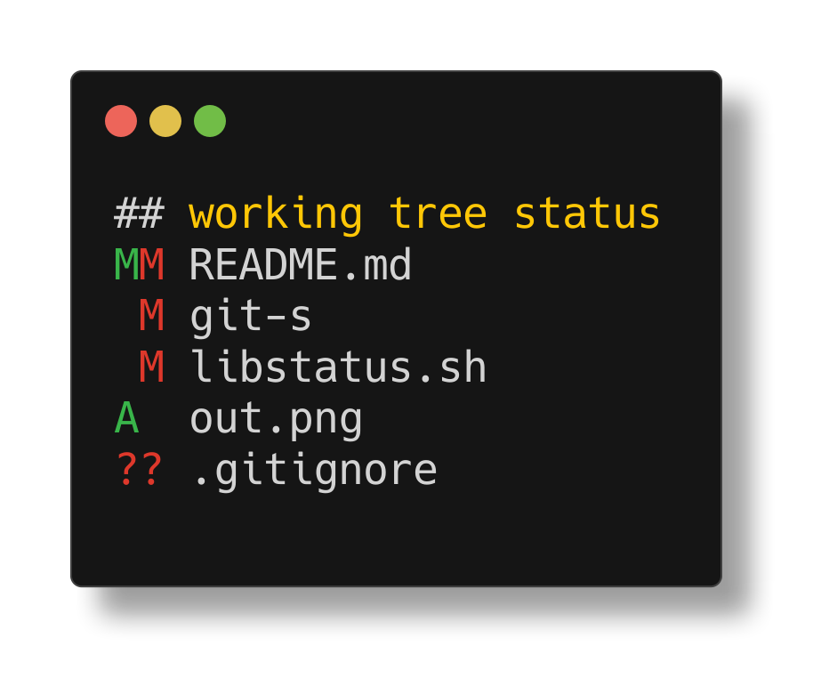
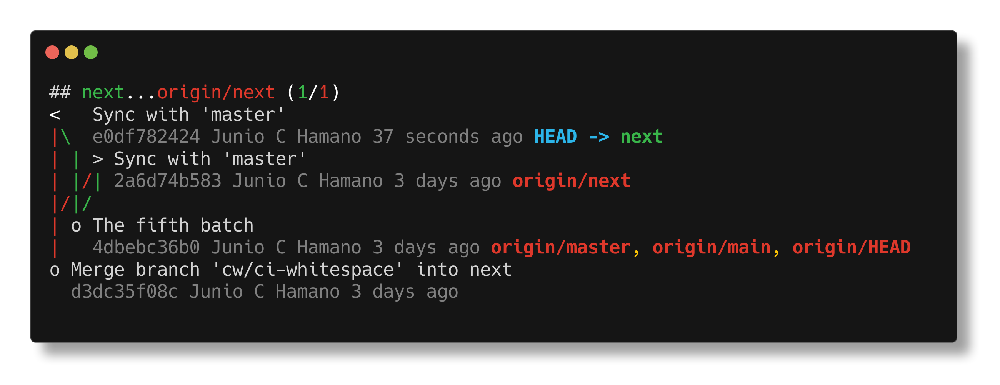
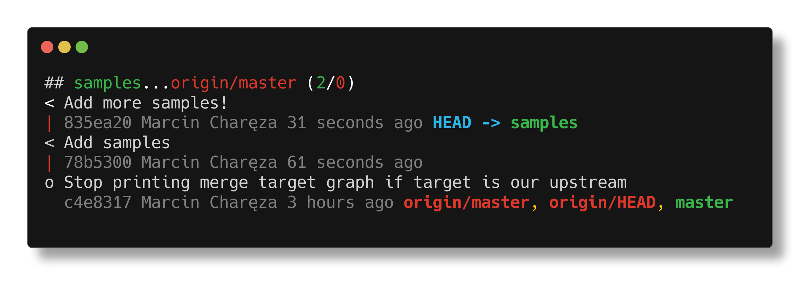
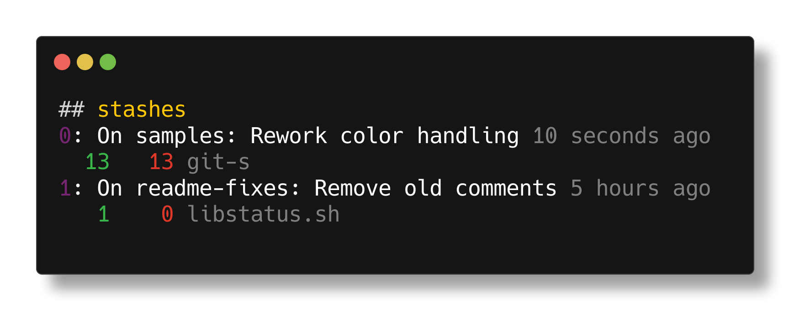
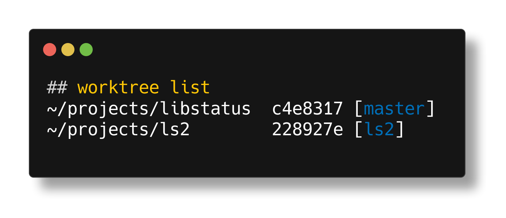
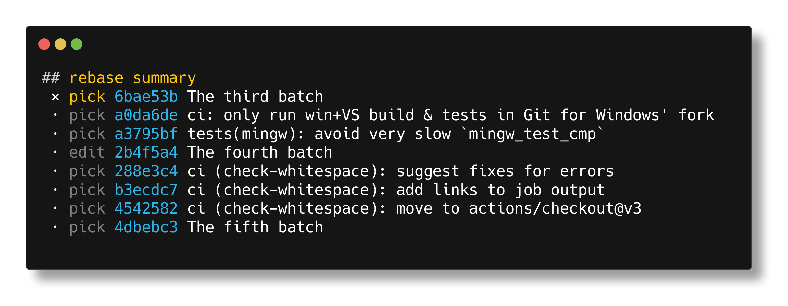
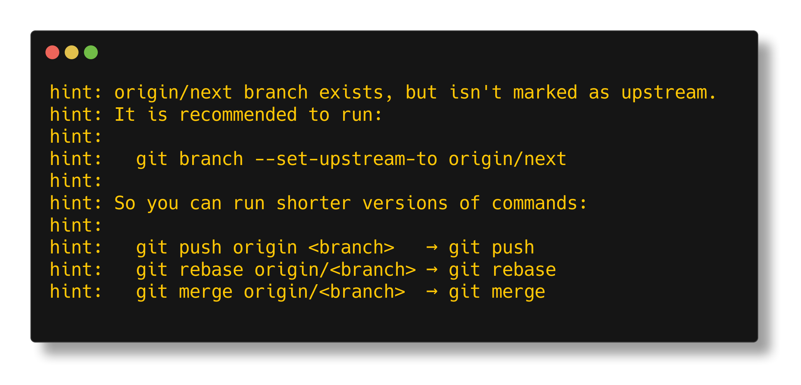
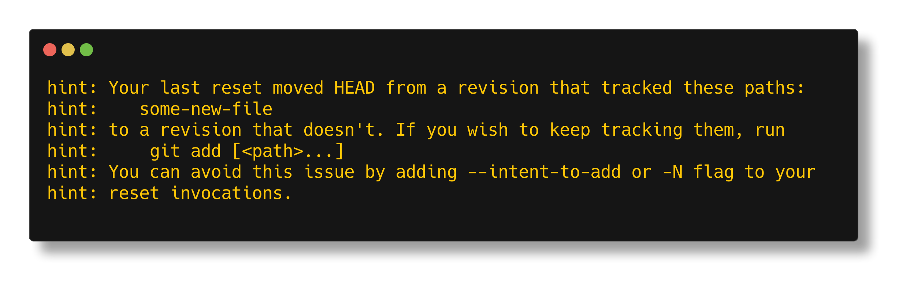

# libstatus

libstatus is (a toolkit for building) a supercharged, POSIX-compliant
replacement of `git status`.

The functionality is implemented in the `libstatus.sh` file, which serves as
a library intended to be sourced by some other script.

Two example scripts (`git-s` and `git-ss`) using the library are provided. To
use them, you need to make sure they are available in your `$PATH`. Configuring
the `$PATH` variable is out of scope of this README, but there's plenty
information online.

Currently implemented features:
  - working directory status (using `git status --short` condensed output; see `git help status` for more info),
    
  - graph of commits on your branch and its tracked remote counterpart,
    
  - graph of commits on your branch and the branch it'll be merged to (using `<remote>/HEAD` to guess, can be overridden),
    
  - list of stashes along with listing of their changes,
    
  - worktree summary,
    
  - submodule status and summary,
  - rebase progress status,
    
  - hints about remote branch tracking, merges lost when rebasing without `--rebase-merges`,
    and about files lost from tracking due to reset without `--intent-to-add`.
    
    
